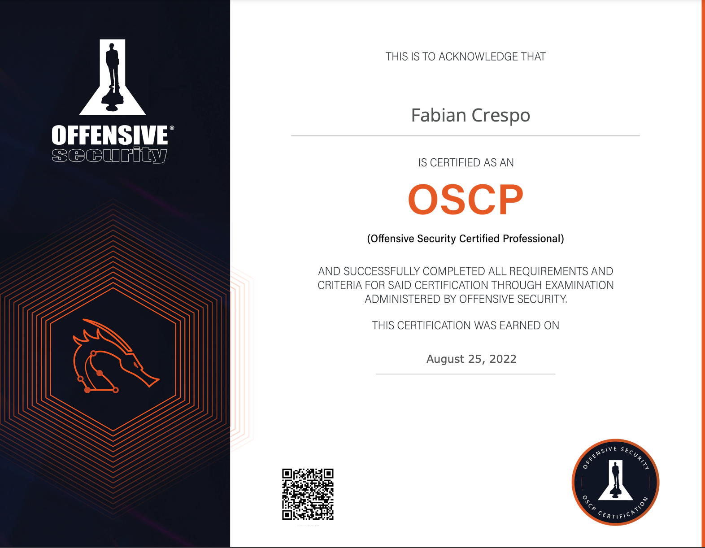
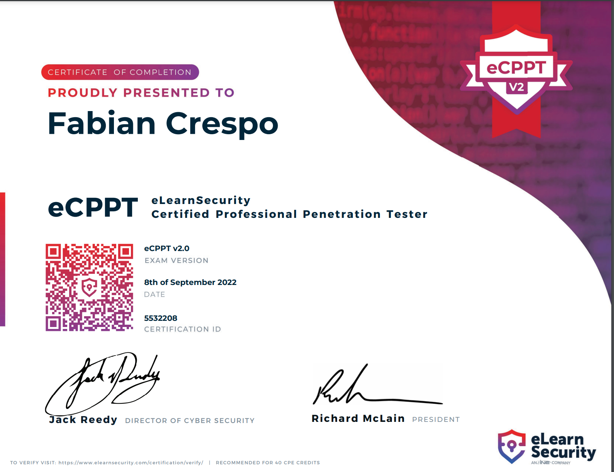
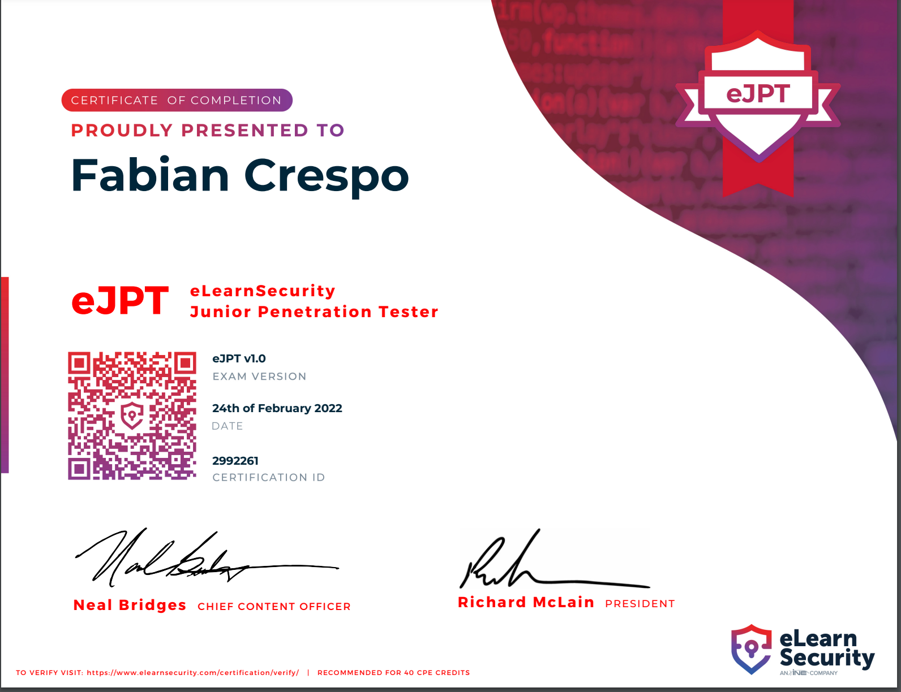

# 😃 Welcome

## More about me&#x20;

My name is Fabian. I am currently a freshman attending college, I started my pen testing journey about a year ago. Although, I always found hacking an interesting subject and I was really curious about it at some point in my life, I never really pursued it. Towards the end of High School I was convinced that I wanted to become a Digital Artist for Riot Games, the more time passed I became unsure as to whether I really wanted to do that  as my career. It wasn't until I wondered around different majors undecided that one day I was having a conversation with my girlfriend, and she had asked me "Oh my god, wouldn't it be cool if you were one of those hacker guys?" and from there I started digging and looking at what hacking was, where I could get training, it opened my eyes to this beautiful career path, that if it wasn't for her I would have probably never been here. I started doing the "Pre-Security" Track on TryHackMe until I got all the way to the "Complete Beginner Track" after that I started preparing for the eJPT, I passed it in February of 2022. Fast forward present time, I am now OSCP, eCPPTv2 Certified.&#x20;

<figure><figcaption></figcaption></figure>

<figure><figcaption></figcaption></figure>

<figure><figcaption></figcaption></figure>
<figure><figcaption></figcaption></figure>

I am now pursuing the OSEP.

I hope some of you get value out of this blog and the write ups.&#x20;
