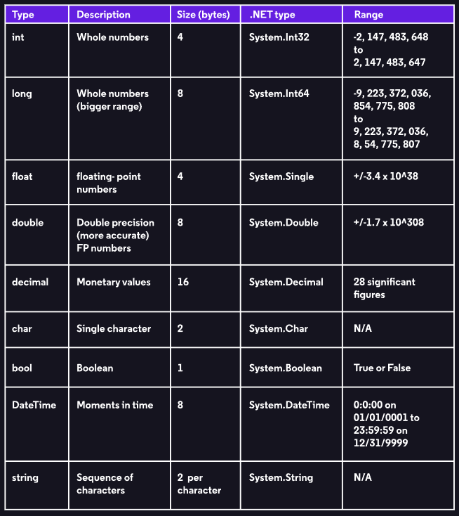

# C# Programming



Learned how to build code using visual studio.&#x20;

### Printing Text

* Whenever a line of instructions are done, always end with a semi-colon at the end.&#x20;
* The command Console.WriteLine("Hello"); prints out text.&#x20;
* The command Console.ReadLine(); is used to stop the console from terminating after the command is ran.&#x20;
  * .png>)
* The command dotnet run, in bash allows the execution of the C# Code.&#x20;
  * 

```csharp
using System;

namespace HelloWorld
{
  class Program
  {
    static void Main()
    {
      Console.WriteLine("My Name is Fabian");  
      Console.ReadLine();  
     }
  }
}
 
```

### Variable Names

* string \<name> = "John"
* int \<name> = 13; Whole numbers, and negative numbers
  * int \<name>;
    * \<name> = 13;
* char \<name> = 'A'; This stands for character.&#x20;
* float, double, decimal these represent decimal numbers. They go from least accurate to most accurate.&#x20;
* bool \<name> = true or false;&#x20;


<figure><figcaption></figcaption></figure>

### User Input

* The command Console.ReadLine(); is used to read input that is why it is used to make the application stay still since it is reading the input.&#x20;
* You can assign a variable name the command Console.ReadLine(); command and it will assign it.&#x20;
* Once the variable is declared we can print it out using the Console.WriteLine($"{Variable-name}");
* Or alternatively Console.WriteLine("Your name is " + \<variablename>)
* ORRRR Console.WriteLine("Your name is" + name +  " and your " + age + "old");

```
using System;
using System.Collections;
using System.Linq;
using System.Text;
using System.Threading.Tasks;


namespace Giraffe
{
    class Program
    {
        static void Main(string[] args)
        {
            Console.WriteLine("What is your name?");
            string name = Console.ReadLine();
            Console.WriteLine($"Your name is {name}");
            Console.ReadLine();
        }
    }


}
```


### Comments

The syntax of comments are basically the same as C.&#x20;

```
/* This is a comment */
```

### Conditional Statements

```
using System;

namespace IfElseStatement
{
  class Program
  {
    static void Main(string[] args)
    {
      int people = 12;
      string weather = "bad";
      if (people <= 10 && weather == "nice")
      {
        Console.WriteLine("SaladMart");
      }
      else
      {
        Console.WriteLine("Soup N Sandwich");

      }
    }
  }
}
```

### Switch Statements

Switch statements are easier for validating conditions and executing it rather than having it be a chain of if, else if, else if, else if, else.&#x20;

```csharp
string color;
 
switch (color)
{
   case "blue":
      // execute if the value of color is "blue"
      Console.WriteLine("color is blue");
      break;
   case "red":
      // execute if the value of color is "red"
      Console.WriteLine("color is red");
      break;
   case "green":
      // execute if the value of color is "green"
      Console.WriteLine("color is green");
      break;
   default:
      // execute if none of the above conditions are met
      break;
}
```
