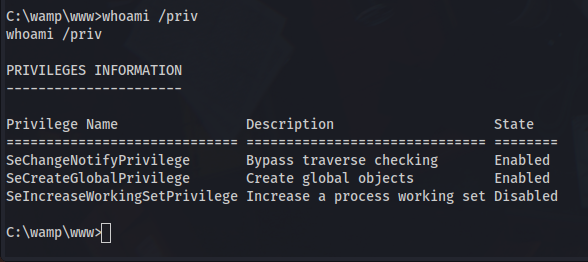

# Local Service / Network Service Users

On Windows, some services executed as `LOCAL SERVICE` or `NETWORK SERVICE` are configured to **run with a restricted set of privileges**. Therefore, even if the service is compromised, **you won't get the golden impersonation privileges** and privilege escalation to `LOCAL SYSTEM` should be more complicated. However, I found that, when you **create a scheduled task**, the new process created by the **Task Scheduler Service** has **all the default privileges** of the associated user account (except _SeImpersonate_). Therefore, with some token manipulations, you can spawn a new process with all the missing privileges



We transfer the FullPowers.exe binary to the machine and we execute it.

Here is the POC:

Before:&#x20;

After:

.png>)

After having the SeImpersonatePrivilege all we have left to do is run PrintSpoofer.exe

.png>)
